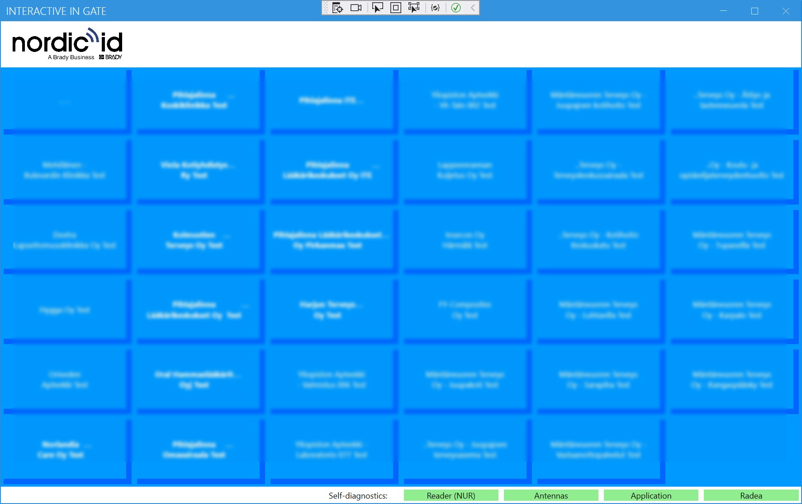

# radea_app_InteractiveInGate (IIG)
Windows UI application for managing incoming items gate.

## Operation
1. IIG shows customers in a button matrix
2. When a shipment arrives, user selects which customer it arrived from by pressing the respective button
3. IIG reads the identities of the RFID tagged incoming items and checks that they all are from the selected customer




* Below is the `Sample_iigate.json` that can be used for defining configuration specific for new setups:
  ```json
  // Sample Interactive In Gate configuration file
  {
    "Localization": "en-US",  // User interface localization selection: "fi-FI" or "en-US"
    "AutoConfirmTimeout": 30, // Time (s) after which the routing report page is automatically closed
    "TagsWaitTimeout": 20,    // Max. duration (s) of the progressbar animation in the routing page
    "SortLocations": true,    // Optional, true or false (default). If true, locations are sorted alphabetically.
    "HideSingleRoot": true,   // Optional, true or false (default). If true, single root location is not shown in UI.
    "StreamInventory": true,
    ...
  "executor": {
    "description": "Interactive In Gate configuration",
    "process": [
      { // process configuration (first)
        // Replaced by "operating_mode"
        // "is_interactive_in_gate": true,  // Must be set true for Interactive In Gate.
        // Must be "InteractiveInGate" for Interactive In Gate.
        "operating_mode": "InteractiveInGate", // "RouterGate" (default), "TrackAndTraceRouter", "InteractiveInGate"

  }
  ```
